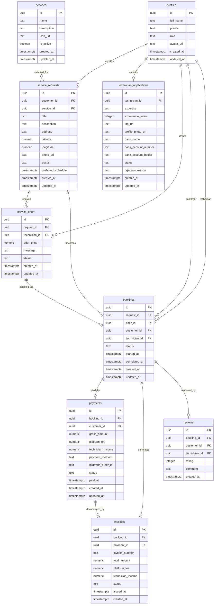

# Entity Relationship Diagram

Dokumen ini menjelaskan hubungan antar entitas utama pada database SiTeknisi.

## ERD

## Catatan Relasi

- `profiles.id` terhubung dengan user Supabase Auth.
- Satu Customer dapat membuat banyak `service_requests`.
- Satu `service_request` dapat menerima banyak `service_offers`.
- Satu offer yang dipilih akan menjadi satu `booking`.
- Satu `booking` memiliki satu `payment` dan satu `invoice`.
- Satu `booking` dapat memiliki satu `review`.
- Satu Teknisi memiliki satu data `technician_applications` aktif.

