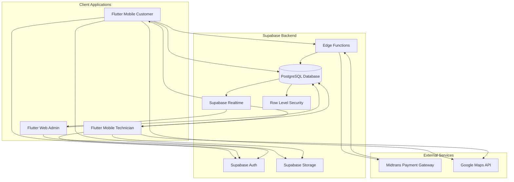
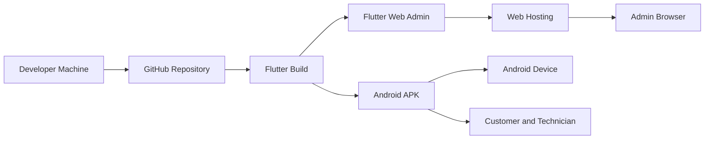

# System Architecture

Dokumen ini menjelaskan arsitektur sistem SiTeknisi untuk MVP UAS.

## 1. Komponen Utama

- Flutter Mobile Customer untuk pengguna Customer.
- Flutter Mobile Technician untuk Teknisi.
- Flutter Web Admin untuk Admin.
- Supabase Auth untuk autentikasi.
- Supabase PostgreSQL untuk database utama.
- Supabase Storage untuk foto request, KTP, dan foto profil.
- Supabase Realtime untuk update status request, offer, booking, dan payment.
- Supabase Edge Functions atau backend function untuk integrasi Midtrans.
- Midtrans untuk payment gateway.

## 2. Architecture Diagram

## 3. Alur Data Utama

### Request Service

1. Customer login melalui Supabase Auth.
2. Customer memilih layanan.
3. Customer mengisi form request service.
4. Foto perangkat diupload ke Supabase Storage.
5. Data request disimpan ke tabel `service_requests`.
6. Teknisi approved menerima update melalui Realtime.

### Offer

1. Teknisi melihat request service terbuka.
2. Teknisi mengirim offer harga.
3. Offer disimpan ke tabel `service_offers`.
4. Customer menerima update offer melalui Realtime.
5. Customer memilih offer.
6. Sistem membuat booking.

### Payment

1. Customer memilih offer dan booking dibuat.
2. Customer menekan bayar.
3. Aplikasi memanggil Edge Function create payment.
4. Edge Function membuat transaksi Midtrans.
5. Customer menyelesaikan pembayaran.
6. Midtrans mengirim notification webhook.
7. Edge Function memvalidasi notification.
8. Database memperbarui payment dan membuat invoice.

### Invoice

1. Payment sukses.
2. Sistem menghitung platform fee dan pendapatan Teknisi.
3. Invoice number dibuat otomatis.
4. Invoice disimpan ke tabel `invoices`.
5. Customer, Teknisi, dan Admin dapat melihat invoice sesuai akses.

## 4. Security Architecture

- Semua user login menggunakan Supabase Auth.
- Token JWT digunakan untuk akses data.
- Row Level Security diterapkan pada tabel sensitif.
- Customer hanya dapat melihat request, booking, payment, invoice, dan review miliknya.
- Teknisi hanya dapat melihat request terbuka, offer miliknya, booking terkait, dan pendapatannya.
- Admin dapat memonitor seluruh data operasional.
- Midtrans notification wajib divalidasi sebelum memperbarui payment.

## 5. Storage Architecture

Bucket yang disarankan:

| Bucket | Isi | Akses |
|---|---|---|
| `request-photos` | Foto perangkat rusak | Customer owner, Teknisi terkait, Admin |
| `technician-documents` | KTP dan dokumen verifikasi | Teknisi owner, Admin |
| `avatars` | Foto profil | Public read terbatas atau signed URL |
| `service-icons` | Ikon layanan | Public read |

## 6. Realtime Channel

Channel yang disarankan:

- `service_requests` untuk request baru dan perubahan status.
- `service_offers` untuk offer baru.
- `bookings` untuk perubahan booking.
- `payments` untuk perubahan payment.
- `invoices` untuk invoice baru.

## 7. Deployment View

