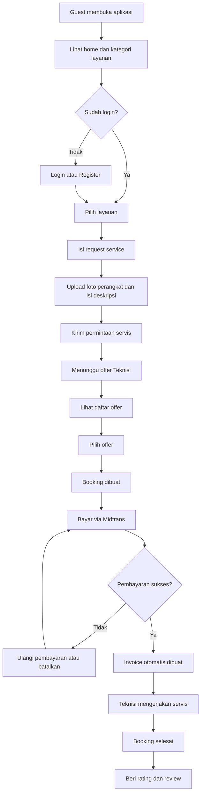
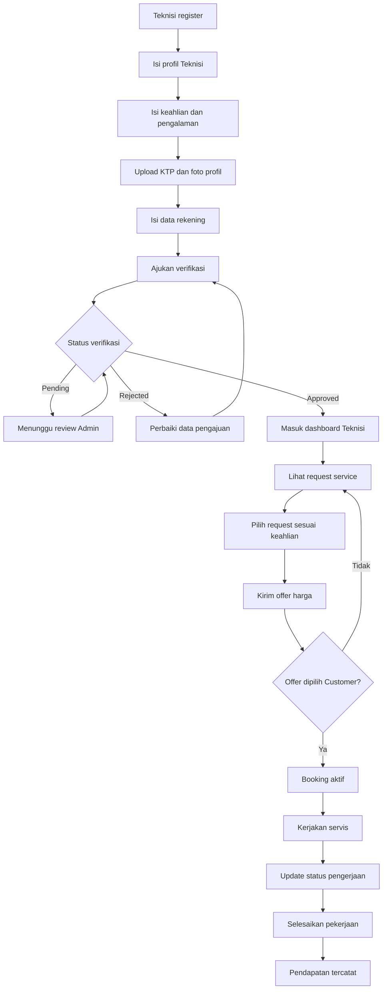
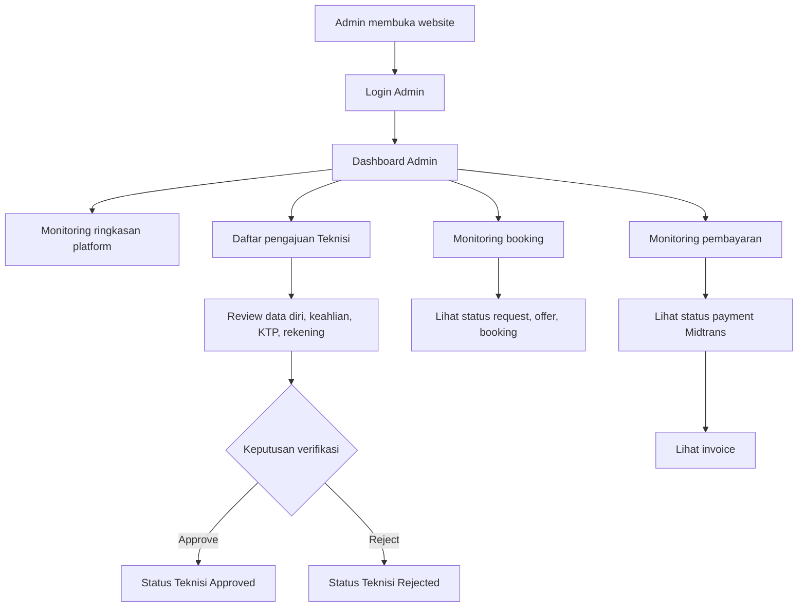
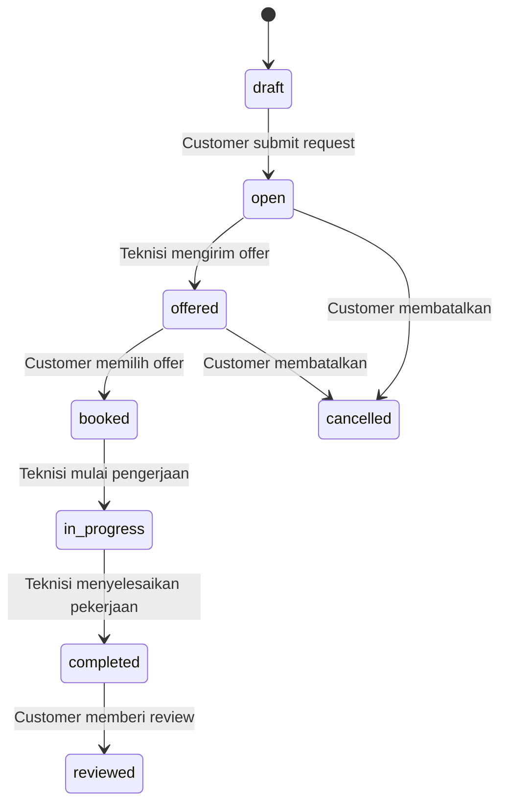
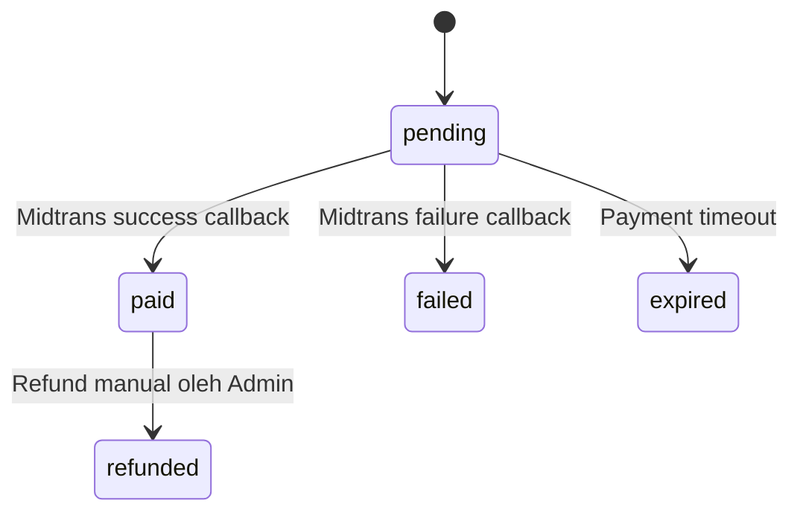

# User Flow

Dokumen ini menjelaskan alur utama pengguna SiTeknisi untuk role Customer, Teknisi, dan Admin.

## 1. Customer Flow

Alur utama: Guest -> Login -> Request Service -> Offer -> Payment -> Invoice -> Review.

## 2. Teknisi Flow

Alur utama: Register -> Verifikasi -> Terima Request -> Kirim Offer -> Kerjakan -> Selesai.

## 3. Admin Flow

Alur utama: Login -> Verifikasi Teknisi -> Monitoring Booking -> Monitoring Pembayaran.

## 4. Status Flow Service Request

## 5. Status Flow Payment

