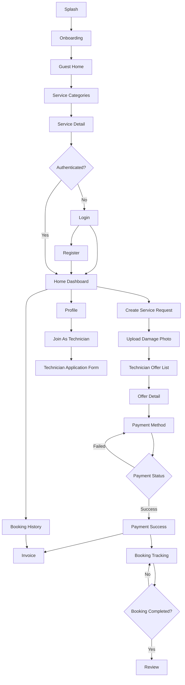
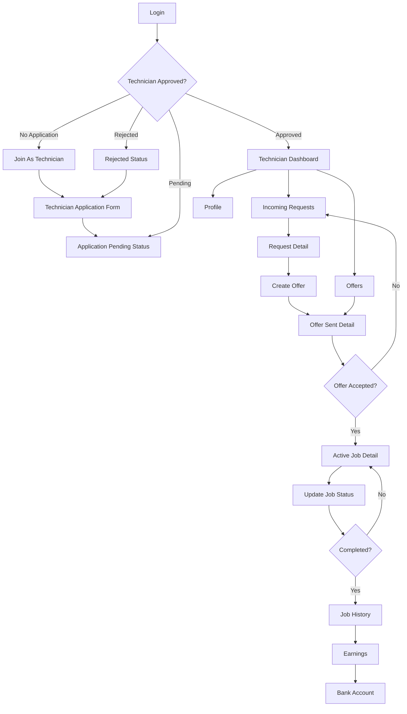
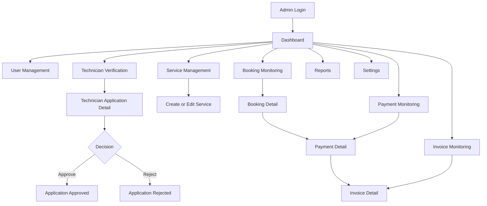

# Screen Flow

Dokumen ini memvisualisasikan perpindahan layar utama untuk Customer, Technician, dan Admin.

## 1. Customer Flow

```mermaid
flowchart TD
    A[Splash] --> B[Onboarding]
    B --> C[Guest Home]
    C --> D[Service Categories]
    D --> E[Service Detail]
    E --> F{Authenticated?}
    F -- No --> G[Login]
    G --> H[Register]
    G --> I[Home Dashboard]
    H --> I
    F -- Yes --> I
    I --> J[Create Service Request]
    J --> K[Upload Damage Photo]
    K --> L[Technician Offer List]
    L --> M[Offer Detail]
    M --> N[Payment Method]
    N --> O{Payment Status}
    O -- Success --> P[Payment Success]
    O -- Failed --> N
    P --> Q[Invoice]
    P --> R[Booking Tracking]
    R --> S{Booking Completed?}
    S -- No --> R
    S -- Yes --> T[Review]
    I --> U[Booking History]
    U --> Q
    I --> V[Profile]
    V --> W[Join As Technician]
    W --> X[Technician Application Form]
```

## 2. Technician Flow

```mermaid
flowchart TD
    A[Login] --> B{Technician Approved?}
    B -- No Application --> C[Join As Technician]
    C --> D[Technician Application Form]
    D --> E[Application Pending Status]
    B -- Pending --> E
    B -- Rejected --> F[Rejected Status]
    F --> D
    B -- Approved --> G[Technician Dashboard]
    G --> H[Incoming Requests]
    H --> I[Request Detail]
    I --> J[Create Offer]
    J --> K[Offer Sent Detail]
    G --> L[Offers]
    L --> K
    K --> M{Offer Accepted?}
    M -- No --> H
    M -- Yes --> N[Active Job Detail]
    N --> O[Update Job Status]
    O --> P{Completed?}
    P -- No --> N
    P -- Yes --> Q[Job History]
    Q --> R[Earnings]
    R --> S[Bank Account]
    G --> T[Profile]
```

## 3. Admin Flow

```mermaid
flowchart TD
    A[Admin Login] --> B[Dashboard]
    B --> C[User Management]
    B --> D[Technician Verification]
    D --> E[Technician Application Detail]
    E --> F{Decision}
    F -- Approve --> G[Application Approved]
    F -- Reject --> H[Application Rejected]
    B --> I[Service Management]
    I --> J[Create or Edit Service]
    B --> K[Booking Monitoring]
    K --> L[Booking Detail]
    L --> M[Payment Detail]
    B --> N[Payment Monitoring]
    N --> M
    M --> O[Invoice Detail]
    B --> P[Invoice Monitoring]
    P --> O
    B --> Q[Reports]
    B --> R[Settings]
```

